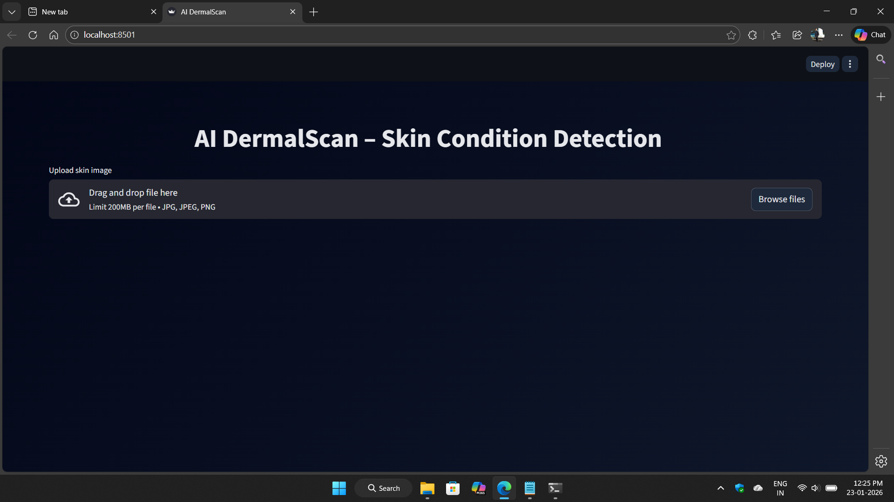

# 🧠 AI DermaScan – Skin Condition Detection

AI DermaScan is a deep learning–based facial skin condition analysis system that detects faces from images, classifies skin conditions, visualizes bounding boxes, estimates age ranges, and allows exporting results.

This project was developed as part of the **Infosys Springboard Virtual Internship 6.0 Program**.

---

## 📌 Project Type
**Computer Vision | Deep Learning**

---

## 🛠️ Technologies Used
- Python 3.10  
- Streamlit (Web Application)  
- TensorFlow / Keras  
- MobileNetV2  
- OpenCV  
- NumPy, Pandas  
- Haar Cascade (Face Detection)

---

## 🎯 Features
- Upload facial skin images (JPG / PNG)
- Multi-face detection support
- Skin condition classification:
  - Clear Skin
  - Dark Spots
  - Puffy Eyes
  - Wrinkles
- Bounding box visualization with labels
- Random age estimation based on skin condition
- Prediction summary table
- Prediction history logging
- Export predictions as CSV
- Download annotated images
- Interactive dark-themed UI

---

## 🧬 Skin Condition → Age Mapping

| Skin Condition | Age Range |
|---------------|-----------|
| Clear Skin    | 18 – 25   |
| Dark Spots   | 25 – 40   |
| Puffy Eyes   | 40 – 55   |
| Wrinkles     | 55+       |

> Age values are randomly generated within the defined range for demo and presentation purposes.

---

## 🖼️ Sample UI Screenshots
### Home Screen

### Annotated Output

### CSV Export


## 🧠 Model Details

- Architecture: MobileNetV2
- Framework: TensorFlow / Keras
- Input Size: 224 × 224
- Output Classes: 4
- Model File: mobilenetv2_module3.h5

## 📂 Project Structure
```md
AI_DermaScan/
├── app.py
├── model/
│   └── mobilenetv2_module3.h5
├── exports/
│   ├── images/
│   └── logs/
├── screenshots/
├── haarcascade_frontalface_default.xml
├── requirements.txt
└── README.md
```

### ▶️ How to Run the Project
1️⃣ Install Dependencies
```md
pip install -r requirements.txt
```
2️⃣ Run the Streamlit Application
```md
streamlit run app.py
```
3️⃣ Open in Browser
```md
http://localhost:8501
```

## 📤 Export & Logging

- Annotated images are saved in:
```md
exports/images/
```

- Prediction history is stored during runtime
- CSV export option available from UI

## 🧪 Testing

- Tested on:

  - Single face images
  - Multiple face images
  - Different lighting conditions

- Verified:

  - Correct bounding boxes
  - Proper CSV formatting
  - Log consistency
 
# 👤 Author
## Rounak Mishra
Infosys Springboard Virtual Internship 6.0 Program