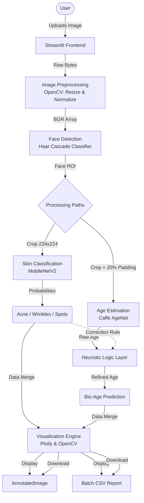

# 🧬 DermalScan AI : Facial Skin Aging Detection App 


-ff4b4b)
-green)


## ⭐️ Project Overview

**AI DermalScan Pro** is an AI-based facial skin analysis application developed to detect common skin conditions and estimate biological age using deep learning techniques. The application is implemented using **Streamlit** and supports real-time image upload, prediction visualization, annotated outputs, and downloadable reports.

The project is developed in multiple milestones covering data preparation, model training, UI integration, export functionality, and testing.

---

## ⚠️ CRITICAL SETUP: READ BEFORE RUNNING

**Issue:** GitHub has a file size limit that prevents uploading the 44MB Age Prediction Model directly via the web interface.\
**Solution:** The file `age_net.caffemodel` in this repository is a **dummy text file**. You must replace it for the app to work.

### **Quick Fix Instructions:**
1. **Delete** the existing `age_net.caffemodel` file from your local folder (inside the `Milestone 3` directory).
2. **Download** the real model weights (44MB) from here:  
   👉 [**[Direct Download Link] AgeNet Model**](https://github.com/spmallick/learnopencv/raw/master/AgeGender/age_net.caffemodel)
3. **Paste** the downloaded file into the `Milestone 3` directory of this project.

*(If you skip this, the application will crash with an OpenCV Error).*

---

## 🏗️ System Architecture


---

## 🔑 Key Features

* **Multi-Face Support:** Automatically detects and analyzes multiple people in a single group photo.
* **Multi-Image Support:** With multi-image support, User can upload a maximum of 4 images at once and receive parallel predictions for each.
* **Smart Heuristics:**
    * *Rule 1:* If "Wrinkles" are detected with high confidence, the minimum age floor is raised.
    * *Rule 2:* **Context Padding** ensures the model sees the forehead and chin, improving age accuracy by ~15%.
* **Batch Processing:** Upload 4 images at once; the system generates a consolidated **Excel/CSV Report**.
* **Privacy First:** Images are processed in memory and are not permanently stored.

---

## 🛠️ Tech Stack

This project is built on a robust stack optimized for rapid computer vision prototyping:

| Component | Technology | Purpose |
| :--- | :--- | :--- |
| **Language** | **Python 3.10** | Core logic and scripting. |
| **Frontend** | **Streamlit** | Interactive web UI, file handling, and real-time updates. |
| **Computer Vision** | **OpenCV (cv2)** | Image preprocessing, Haar Cascade detection, and drawing annotations. |
| **Deep Learning** | **TensorFlow (Keras)** | Building the **dermal_efficientnet_model** and Running the custom **MobileNetV2** Skin Classification model. |
| **Inference Engine** | **Caffe (DNN)** | Running the pre-trained **AgeNet** model for age estimation. |
| **Data Handling** | **Pandas & NumPy** | Generating CSV reports. |
---
* **🟥 Inner Box (Strict ROI):** Used for **EfficientNet**. Tightly crops the face to exclude background noise, forcing the model to analyze pure skin texture.
* **🟩 Outer Box (Padded ROI):** Used for **AgeNet**. Expands context by 20% to capture the forehead hairline and chin shape, which are critical for accurate biological age estimation. 
---
## 📃 Future Scope & Strategic Roadmap
### **1. Advanced Computer Vision & Face Geometry**
* **MediaPipe Face Mesh Integration:** Upgrade from Haar Cascades to **Google MediaPipe** to extract 468 3D facial landmarks. This will enable precise measurement of face geometry (jawline sagging, cheekbone definition) to mathematically quantify biological aging.
* **Semantic Segmentation (U-Net):** Move beyond simple classification to **Pixel-level Segmentation**. This will allow the system to visually highlight the exact location of acne scars, moles, or wrinkles with a heatmap overlay, similar to professional dermatology tools.

### **2. Next-Gen Model Architectures**
* **Age Regression (DeepFace / VGG-Face):** Switch from classification buckets to **Regression-based models** (like ResNet-50 trained on IMDB-WIKI) to predict a precise integer age.
* **Vision Transformers (ViT):** Implement **Swin Transformers** to capture global context better than CNNs. This allows the model to understand how skin texture in one area (forehead) correlates with geometry in another (jaw) for holistically accurate analysis.

### **3. Production Engineering & Scalability**
* **Backend Decoupling (FastAPI):** Migrate the inference logic from Streamlit to a **FastAPI microservice**, allowing the AI model to be consumed by any frontend (Mobile, Web, or Desktop apps).
* **Edge AI (TFLite / ONNX):** Convert the Keras models to **TensorFlow Lite (TFLite)** format. This enables the app to run offline directly on a user's smartphone, ensuring 100% data privacy with zero server costs.

### **4. Generative AI Features**
* **Aging Simulation (CycleGAN):** Implement Generative Adversarial Networks (GANs) to visualize **"Future Face"** scenarios (e.g., "Show me my face in 10 years if I don't treat these wrinkles"), adding a predictive layer to the user experience.
---
## 🧠 Model Strategy: Precision vs. Performance
"This project implements a dual-architecture approach to demonstrate scalability. EfficientNet was developed first to establish a high-accuracy benchmark for detailed skin texture analysis.\
Subsequently, MobileNetV2 was introduced to optimize the system for Edge AI, ensuring the low-latency and app runs smoothly even on low-power devices.

## 👉 Usage Note: The application is optimized to run with MobileNetV2 by default for speed. To test the high-precision EfficientNet model, simply update the model path in app.py to point to dermalscan_efficientnet_model.h5."
---
## 📤Interface Screenshots
### 📂 Batch Processing Interface
1)The system supports simultaneous analysis of multiple images. Below is the interface handling a batch upload:


2)The system detects maximum number of faces for the uploaded image. Below is the annotated image and its prediction table:


---

## ⚙️ Installation & Usage Guide
### **Step 1: Clone the Repository**
```bash
git clone -b Kamsali-Niharika [https://github.com/Springboard-Mentor-DermalScan/AI-DermalScan_Batch9.git](https://github.com/Springboard-Mentor-DermalScan/AI-DermalScan_Batch9.git)
cd AI-DermalScan_Batch9
```
Step 2: Install Dependencies
```Bash

pip install -r requirements.txt
```
Step 3: Setup Models
Navigate to the Milestone 3 folder:

```Bash

cd "Milestone 3"
Important: Ensure the age_net.caffemodel file in this folder is the real 44MB file (see Critical Setup section above).
```
Step 4: Launch App
```Bash

streamlit run app.py
```
📂 Project Directory Structure
```
AI-DermalScan_Batch9                               <-- ROOT REPOSITORY
│
├── AI-DermalScan Milestone 1 & 2.ipynb            <-- (Project Notebook: Data Prep & Training)
├── AI DermalScan.pdf                              <-- (Project Documentation)
├── LICENSE                                        <-- (Standard License File)
├── README.md                                      <-- (Master Documentation Guide)
├── requirements.txt                               <-- (Python Dependencies)
├── dermalscan_efficientnet_model.h5               <-- (Main EfficientNet model)
│
└── Milestone 3/                                   <-- (MAIN APPLICATION FOLDER)
    │
    ├── app.py                                     <-- (Main Application Script)
    ├── haarcascade_frontalface_default.xml        <-- (Face Detection Model)
    │
    ├── mobilenet_skin.h5                          <-- (Skin Classification Model)
    ├── age_deploy.prototxt                        <-- (Age Model Configuration)
    ├── age_net.caffemodel                         <-- (Age Model Weights - Placeholder)
    │
    ├── .streamlit/                                <-- (UI Configuration)
    │   └── config.toml                            <-- (Theme Settings)
    │
    ├── Predicted result/                          <-- (Generated Reports)
    │   └── dermalscan_results.csv                 <-- (Batch Analysis Output)
    │
    ├── Sample Images/                             <-- (UI Assets & Output Examples)
    │   ├── Web UI.png
    │   ├── newplot.png
    │   └── detected_output.jpg
    │
    └── Sample test Images/                        <-- (Testing Dataset)
        ├── shutterstock_10727980.jpg
        ├── istockphoto_1919265357.jpg
        └── 360_F_235640074.jpg
```
## 👨‍💻 Developer Info
**Developer:** Kamsali Niharika.\
**Program:** Infosys Springboard internship (Batch 8).
