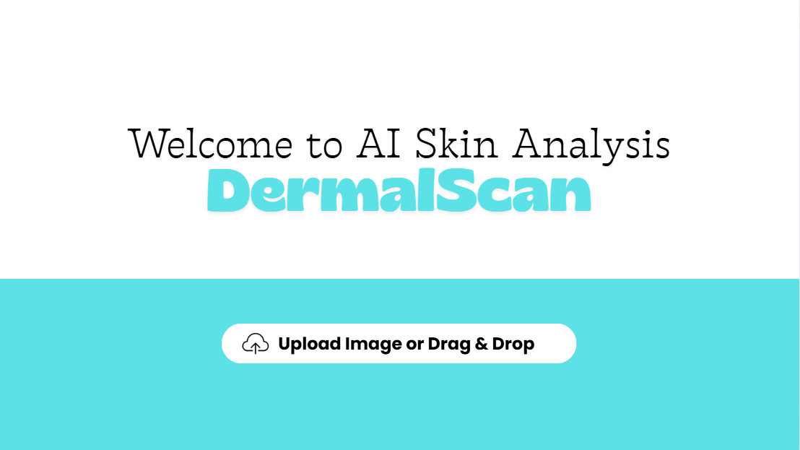
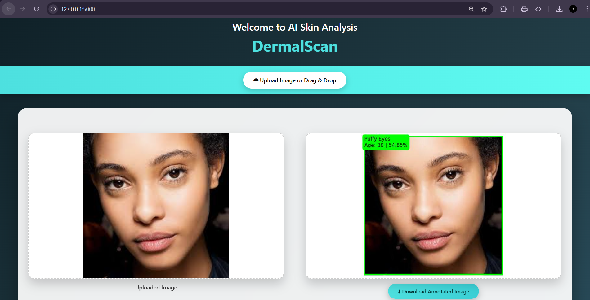
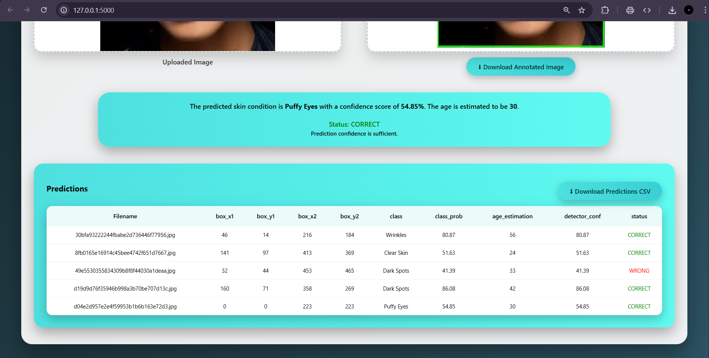

# AI DermalScan

[](https://opensource.org/licenses/MIT)
[](https://www.python.org/)
[](https://flask.palletsprojects.com/)
[](https://www.tensorflow.org/)

DermalScan - AI Skin Analysis is an advanced web-based application for automated skin analysis using deep learning. It leverages computer vision and machine learning to detect facial features, classify skin conditions, and estimate age from uploaded images. Built with Flask, TensorFlow, and OpenCV, it provides a user-friendly interface for real-time skin health assessments.

## Features

- **Face Detection**: Utilizes OpenCV's DNN-based face detector for accurate facial recognition in images.
- **Skin Condition Classification**: Classifies skin into four categories: Clear Skin, Dark Spots, Puffy Eyes, and Wrinkles using a fine-tuned MobileNetV2 model.
- **Age Estimation**: Provides age range estimates based on detected skin conditions and model confidence.
- **Multi-Face Support**: Handles images with multiple faces, providing individual analysis for each detected face.
- **Web Interface**: Intuitive HTML/CSS/JavaScript frontend for easy image uploads and result visualization.
- **Annotated Results**: Generates annotated images with bounding boxes and labels for visual feedback.
- **Data Export**: Download predictions as CSV files and annotated images for further analysis.
- **Session Management**: Maintains user sessions for multiple analyses without data loss.

## Screenshots

### Initial UI Design


### User Interface 1


### User Interface 2


## Installation

### Prerequisites

- Python 3.8 or higher
- pip package manager

### Steps

1. **Clone the repository:**
   ```bash
   git clone https://github.com/your-username/ai-dermalscan.git
   cd ai-dermalscan
   ```

2. **Create a virtual environment (recommended):**
   ```bash
   python -m venv venv
   source venv/bin/activate  # On Windows: venv\Scripts\activate
   ```

3. **Install dependencies:**
   ```bash
   pip install -r requirements.txt
   ```

4. **Download required models:**
   - The application uses pre-trained models included in the repository.
   - Ensure all `.h5` model files and OpenCV cascade files are present in the root directory.

## Usage

1. **Start the application:**
   ```bash
   python app.py
   ```

2. **Access the web interface:**
   Open your browser and navigate to `http://localhost:5000`

3. **Upload an image:**
   - Click the "Upload Image For Analysis" button
   - Select a facial image (JPEG, PNG, etc.)
   - The application will process the image and display results

4. **View results:**
   - Annotated image with detected faces and classifications
   - Detailed predictions table with confidence scores and age estimates
   - Download options for annotated images and CSV data

## Project Structure

```
AI_DermalScan/
├── app.py                          # Main Flask application
├── requirements.txt                # Python dependencies
├── LICENSE                         # MIT License
├── README.md                       # Project documentation
├── AI_DermalScan_Documentation.pdf # Detailed project documentation
├── dermalscan.ipynb                # Jupyter notebook for model development
├── dermalscan_notebook2_milestone2.ipynb  # Additional notebook
├── dataset_split.py                # Dataset splitting script
├── deploy.prototxt                 # OpenCV face detection config
├── res10_300x300_ssd_iter_140000.caffemodel  # OpenCV face detection model
├── *.h5                            # Pre-trained TensorFlow models
├── *.png                           # UI design images and plots
├── Dataset/                        # Training dataset
├── Dataset_split/                  # Split dataset for training/validation
├── Models/                         # Saved model checkpoints
├── Outputs/                        # Generated output files
├── static/                         # Static web assets (CSS, JS, images)
│   ├── css/
│   ├── uploads/                    # Uploaded images
│   └── outputs/                    # Annotated output images
├── templates/                      # HTML templates
│   └── index.html                  # Main web interface
└── visualizations/                 # Data visualization outputs
```

## Requirements

- Flask==3.0.0
- gunicorn
- tensorflow-cpu==2.15.0
- opencv-python-headless
- numpy
- matplotlib

## Models

The application uses several pre-trained models for skin analysis:

- **MobileNetV2_Model2_Final.h5**: Primary model for skin condition classification
- **EfficientNetB0.h5**: Alternative efficient model
- **ResNet50.h5**, **ResNet50_best.h5**: ResNet-based models
- **VGG16.h5**, **VGG16_best.h5**: VGG-based models

## API Endpoints

- `GET /`: Main web interface
- `POST /predict`: Image analysis endpoint
- `GET /download_image/<filename>`: Download annotated image
- `GET /download_csv`: Download predictions as CSV

## License

This project is licensed under the MIT License - see the [LICENSE](LICENSE) file for details.

## Acknowledgments

- Built as part of the Infosys Springboard Internsip Project
- Utilizes open-source libraries and pre-trained models
- Inspired by advancements in computer vision and dermatological AI research

## Contact

For questions or support, please open an issue on GitHub or contact the maintainers.

---

For more detailed information, refer to [AI_DermalScan_Documentation.pdf](AI_DermalScan_Documentation.pdf).
