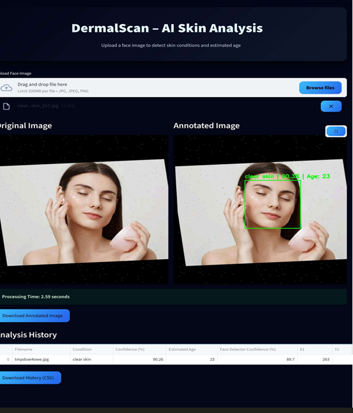

# DermalScan – AI-Based Facial Skin Aging Detection System

---

## Project Overview

**DermalScan** is an AI-powered facial skin analysis system that detects visible skin aging indicators from facial images. The system automatically detects faces, analyzes facial skin, classifies skin conditions (**Clear Skin, Dark Spots, Puffy Eyes, and Wrinkles**), estimates the **age range**, and displays **confidence scores**. All results are presented through a simple and interactive **web-based interface**. add wprkflow image 

---

## Key Features

* AI-based skin condition classification
* Face detection using **Haar Cascade** and **MediaPipe**
* Deep learning using **MobileNetV2**
* Real-time web interface built with **Streamlit**
* Downloadable annotated output images
* Exportable prediction history in **CSV format**

---

##  Technology Stack

### Programming Language

* Python 3.10

### Libraries & Frameworks

| Category         | Tools Used                            |
| ---------------- | ------------------------------------- |
| Deep Learning    | TensorFlow, Keras                     |
| CNN Models       | MobileNetV2, EfficientNetB0, ResNet50 |
| Image Processing | OpenCV, NumPy                         |
| Face Detection   | Haar Cascade, MediaPipe               |
| Visualization    | Matplotlib                            |
| Web UI           | Streamlit                             |
| Data Handling    | Pandas                                |

---
##  Project Structure


##  Project Structure

```
DermalScan/
│
├── app.py                          # Main Streamlit application
├── inference.py                    # Backend inference logic
│
├── requirements.txt                # Python dependencies
├── README.md                       # Project documentation
├── LICENSE                         # License information
│
├── DermalScan.ipynb                # Model training & experimentation notebook
├── DermalscanProject Documentation.pdf  # Complete project documentation
│
├── Annotated image.jpg             # Sample annotated output image
├── CSV.csv                         # Sample prediction results
├── UserInterface.png               # Application UI screenshot
```

---

## ▶️ How to Run the Project

### 🔹 Clone the Repository

Clone the project from GitHub using the command below:

```bash
git clone https://github.com/Springboard-Mentor-DermalScan/AI-DermalScan_Batch9.git
cd AI-DermalScan_Batch9
```

### 🔹 Create a Virtual Environment

Create and activate a virtual environment to manage dependencies:

```bash
python -m venv venv
venv\Scripts\activate   # On Windows
```

### 🔹 Install Required Dependencies

Install all required Python libraries using:

```bash
pip install -r requirements.txt
```

### 🔹 Run the Application

Start the Streamlit application using:

```bash
streamlit run app.py
```

The application will open automatically in your default web browser.

---

## User Interface

The Streamlit-based UI allows users to:

* Upload facial images
* View detected face regions
* Analyze skin conditions and age range
* Download annotated images
* Export results as CSV files

---

##  Project Outcomes

* Fully functional AI-based skin aging detection system
* Modular and beginner-friendly code structure
* High accuracy skin classification (**>90%**)
* Clean and professional web interface
* Ready for deployment or further enhancement

---

## Author

**Ashritha Ambati**
Infosys Springboard – Virtual Internship Project
